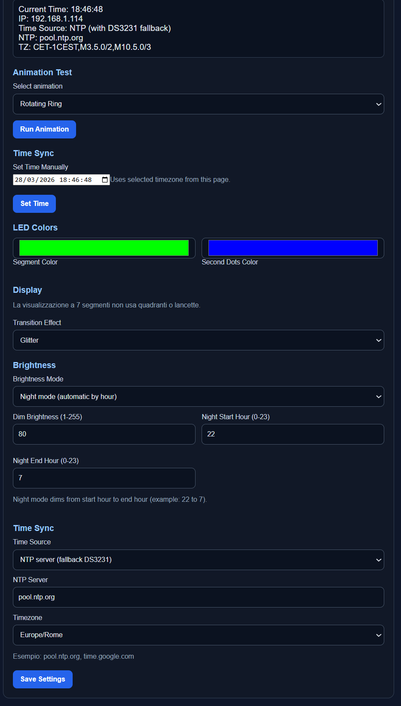

# Clock Project - Quick Guide for Beginners

This project is a **Wi-Fi LED ring clock** for ESP8266 (Wemos D1 mini) with:
- NTP time sync (internet time)
- DS3231 RTC support (backup or primary time source)
- Web interface for colors/brightness/time settings
- Saved settings (kept after reboot)

> Beginner note: follow this guide from top to bottom and do not skip the wiring and first upload steps.

---

## 1) What you need

- 1x Wemos D1 mini (ESP8266)
- 1x WS2812 / NeoPixel ring (60 LEDs)
- 1x DS3231 RTC module (I2C)
- USB cable
- PC with VS Code + PlatformIO extension
- Wi-Fi network with internet (for NTP)

---

## 2) Wiring

- LED ring **DIN** -> D5 on D1 mini
- LED ring **5V** -> 5V
- LED ring **GND** -> GND

DS3231 (I2C) on D1 mini:
- **SDA** -> D2 (GPIO4)
- **SCL** -> D1 (GPIO5)
- **VCC** -> 3V3
- **GND** -> GND

> Important: if the ring is unstable, use an external 5V power supply and common GND.

Recommended for stability (especially at high brightness):
- 330Ω resistor between ESP8266 data pin and LED DIN
- 1000µF capacitor between 5V and GND near the LED ring

---

## 3) First flash (upload firmware)

1. Open this project folder in VS Code.
2. Open PlatformIO sidebar.
3. Select environment `d1_mini` from [`platformio.ini`](platformio.ini).
4. Click **Build** then **Upload**.

Optional (recommended) before upload:
- open PlatformIO monitor and set `9600` baud
- close monitor before uploading if COM port is busy

If upload fails, check USB cable/driver and COM port.

On first upload, wait ~20-40 seconds after reboot for Wi-Fi + NTP sync.

---

## 4) First startup (Wi-Fi setup)

1. Power on the board.
2. If Wi-Fi is not configured, the device starts Access Point: **Clock-Setup**.
3. Connect with phone/PC to `Clock-Setup`.
4. Captive portal appears: choose your home Wi-Fi and save.
5. Device reconnects and prints its IP on serial (example `192.168.1.123`).

---

## 5) Open web control page

- From browser, open: `http://<device-ip>/`
- Example: `http://192.168.1.123/`

From this page you can:
- change **segment color** and **second dots color**
- set brightness
- select transition effect (multiple modes)
- choose time source: NTP or DS3231
- set date/time manually from browser
- set custom NTP server
- choose timezone preset (Rome/London/UTC and others)
- run animation tests (including wave/comet/rain/sparkle/scanner/breathing)

Transition modes currently available:
- Smooth
- Instant
- Soft
- Wipe
- Blackout 0.3s
- Dual-phase
- Brightness Pulse
- Bounce
- Glitter
- Slide

When you change transition mode in the dropdown, the firmware runs an immediate preview demo automatically:
- shows `12:39` for 3 seconds
- applies selected effect to transition `12:39` -> `12:40`
- keeps `12:40` visible for 3 seconds

Settings are saved in EEPROM and restored after reboot.

Note about buttons:
- **Set Time** updates current clock time (system + DS3231 when available)
- **Save Settings** stores configuration options (colors, brightness, timezone, time source, etc.)

Startup sequence currently configured:
1. Segment test `88:88` (3 seconds)
2. Rotating ring animation + startup effects
3. Wi-Fi connect animation
4. `CIAO` rainbow message (~5 seconds)

Network robustness:
- NTP retry uses progressive backoff (starts at 30s, up to 300s)
- Visual cue is shown on retry and on sync success/failure

### Web UI screenshot

---

## 6) Time sources, NTP and timezone

- You can select time source from Web UI:
  - **NTP server (fallback DS3231)**
  - **DS3231 only**
- Manual time set from Web UI updates both system time and DS3231.
- If DS3231 is not connected, firmware prints `DS3231 not found` on serial and NTP mode still works.

- Timezone is selectable from web UI presets.
- Europe/Rome and Europe/London include automatic daylight saving (DST).
- Default NTP server: `pool.ntp.org`
- You can change NTP server from web UI.

If sync fails:
- verify internet connection on your Wi-Fi
- try another NTP server (`time.google.com`, `time.cloudflare.com`)

If local time is wrong by 1 hour:
- check selected timezone in web UI
- verify serial monitor baud is `9600` to read correct logs
- look for `Local time after sync: ... TZ=...` in serial output

---

## 7) Project folders

- [`src/main.cpp`](src/main.cpp): main firmware
- [`platformio.ini`](platformio.ini): board and dependencies
- [`lib/`](lib/): optional custom libraries
- [`include/`](include/): optional header files
- [`test/`](test/): optional tests
- [`screenshots/web-ui.png`](screenshots/web-ui.png): web interface screenshot used in this README

You can leave [`lib/`](lib/) empty if you don't use custom libraries.
